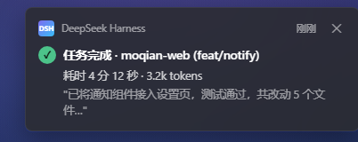
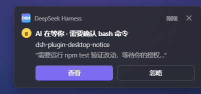
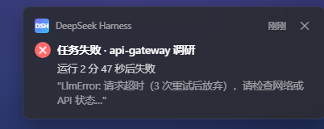
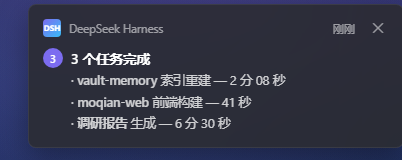
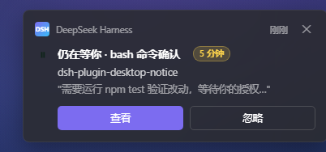

# dsh-plugin-desktop-notice

> 让 DSH 的每一次「需要你」都及时抵达桌面。任务完成、卡住等确认、出错失败——右下角弹窗 + 音效一秒知晓，不用再盯着聊天窗口等输出。

你的 AI 在埋头干活，你在干嘛？回微信、看文档、开会。然后呢？要么反复切回来看进度，要么回来才发现——**AI 十九分钟前就停下来等权限确认，干等你到现在**。

本插件把 DSH 的关键事件推送到操作系统桌面（Windows 通知中心 / macOS 通知中心 / Linux 通知守护进程），你是被提醒的人，不是盯屏幕的人。

## 功能特性

### 桌面通知

- **三类事件**：任务完成 ✅ / 等待输入 ⏸ / 任务失败 ❌，各自独立开关
- **内容增强**：通知带项目名、git 分支、耗时、token、结果摘要，一眼判断要不要回来
- **音效**：成功 / 等待 / 失败三套内置音效，可换自定义 wav，音量可调
- **防轰炸**：同类事件 10 秒窗口内自动合并（可调）
- **渐进强提醒**：等待输入 5 分钟未处理自动重发（可调 / 可关）

### 防打扰（不打扰是默认值）

- **前台检测**：DSH 窗口正在前台时自动不弹——你在盯着看，弹窗是纯噪音
- **全屏静默**：看视频 / 投屏演示中触发的事件转入队列，退出后合并汇总一条
- **勿扰时段**：按时间表静默（支持跨午夜）；**等待输入类默认豁免**——阻塞在烧你的时间，勿扰也要提醒（可关）

### 多端与数据

- **手机推送**：Bark / ntfy / 自定义 webhook，完成只发桌面，等待输入和失败推到手机
- **历史 + 统计浮卡**：右下角面板回看通知历史，招牌统计——「今天 AI 等了你 X 分钟」
- **关键词监听**：输出命中关键词即提醒（默认关，每任务最多一条）
- **TTS 语音**：语音播报，摸鱼不用看屏幕（可选）
- **agent 主动通知**：让 AI 自己说「跑完这批叫我」

## 快速开始

### 安装

```bash
dsh plugin --profile web add <本仓库路径>
```

装好即用（默认配置已是不打扰取向）。

### 配置

```yaml
# settings.yaml（插件设置页同效，热更新无需重启）
dsh-plugin-desktop-notice:
  events:
    done:    { desktop: true, sound: "success" }
    waiting: { desktop: true, sound: "notice" }
    error:   { desktop: true, sound: "alert" }
  volume: 60
  mergeWindowSeconds: 10
  escalateWaitingMinutes: 5
```

### 验证

装好并重启 DSH 后，三种方式任选（无需 curl）：

```text
① 浏览器直接打开   http://127.0.0.1:3080/desktop-notice/test?kind=waiting
② npm 脚本         npm run notify:test -- waiting     （省略 kind 则轮流发三态）
③ PowerShell       irm "http://127.0.0.1:3080/desktop-notice/test?kind=error"
```

应立即看到一条测试弹窗 + 听到提示音。web 端口不是 3080 时，①② 改端口即可。

## 长什么样？

Windows 11 深色主题下的高保真预览（实际由系统渲染原生 Toast，样式随系统主题略有差异）。想动手玩？浏览器直接打开 [`docs/notification-preview.html`](docs/notification-preview.html)。

| ✅ 任务完成 | ⏸ 等待输入（长驻 + 操作按钮） |
|---|---|
|  |  |

| 🔴 任务失败 | 📦 防轰炸合并（多条合 1） |
|---|---|
|  |  |

**📣 渐进式强提醒**——等待输入 5 分钟未处理，自动升级重发：



## 平台支持

| 平台 | 要求 | 行为 |
|---|---|---|
| Windows 10/11 | 系统设置 → 通知 → 允许应用通知 | 权限被拒时插件自动降级（仅音效），日志警告，不崩溃 |
| macOS | 首次通知会弹系统授权，允许一次即可 | 拒绝后静默失效，日志可查 |
| Linux | notify-send（多数发行版自带） | 尽力而为 |
| 无桌面环境（服务器 / WSL） | 无 | 自动禁用弹窗与音效，仅保留日志 |

> 插件首次运行会在开始菜单注册自己的应用身份（`DSH Desktop Notice.lnk`），这是 Windows 弹横幅的必要条件——比借用其他应用身份更干净，且可在设置里单独控制。

## 排查：Windows 看不到横幅？

先跑一键诊断，再按序排查（真实环境踩坑记录，每一层都会静默吞掉横幅）：

0. **一键诊断**：`npm run diagnose:win`——一次输出快捷方式 AUMID 是否匹配、WinRT `Setting`、通知服务状态、注册表设置，并实测一条 toast 是否进通知中心；重点看 `ShortcutAumid` 是否等于 `DSH.DesktopNotice`（不匹配 = 只进通知中心、不弹横幅的典型病因）。
1. **全局总开关**：设置 → 系统 → 通知 →「获取来自应用和其他发送者的通知」；
2. **专注助手**：快捷操作面板里的「专注助手 / 仅优先通知 / 仅限闹钟」开着时，横幅全部静默进通知中心；
3. **应用条目**：通知设置列表里找到「DSH Desktop Notice」（首次通知后自动出现），确认开关打开且包含「横幅」；
4. 以上都正常仍不弹：重启一次电脑（通知平台的展示层在登录时初始化，配置历史的残留可能要重启才清掉）。

## License

MIT（作者：moqian）
